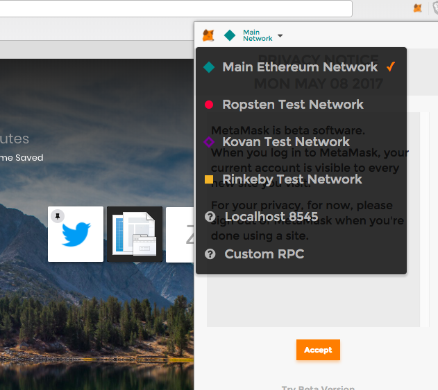
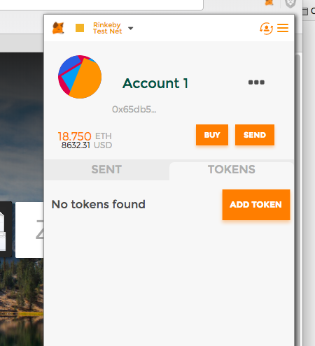

# Mock ICO on Private / Testnet for Government Blockchain Association

## Setup

* Download metamask chrome plugin
* From top dropdown within metamask plugin, select rinkeby testnet from dropdown 

* Create a new metamask account - save your info that instructs you to save. This is your ethereum address for testing (not real eth)
* Add your address to this list: https://twitter.com/benjaminmbrown/status/978638292492091392
* GET FREE TEST ETH: https://www.rinkeby.io/#faucet - this requires you tweeting a public post with your newly created test ethereum address in order to avoid spam. I may be able to send some as well.

## -- CREATE ICO ---

### Add New Token Contract to your Metamask

* Any new tokens need to manually be added to your wallet so you can see them - this is to avoid people from spamming new tokens and filling people's wallets with useless / stupid tokens.
* 
* NOTE: Some wallets (myetherwallet) automatically list the main / non spam erc20 tokens by default. You may not have to do this with existing projects

#### Add Token To Your Metamask

Add the following info for token:

* Token Contract Address: see @benjaminmbrown tweet
* Token Symbol: GBATOKEN
* Decimals of Precision: 18

